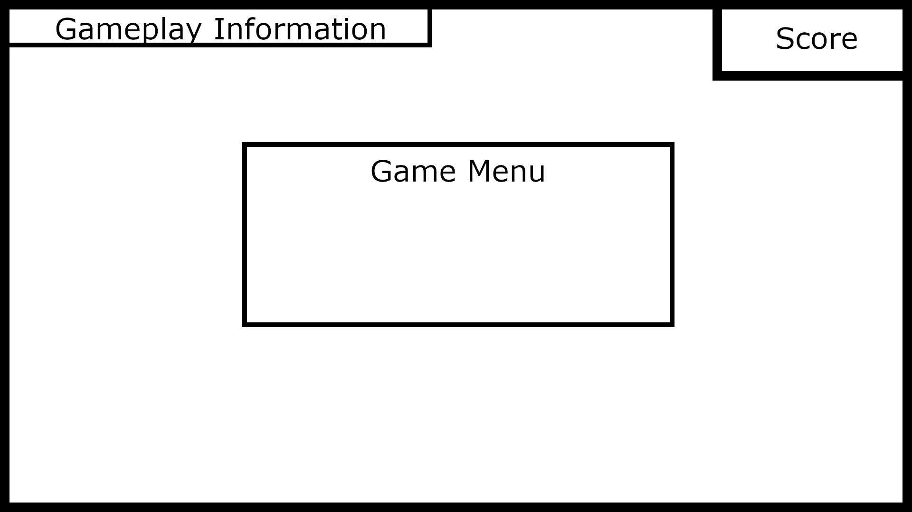
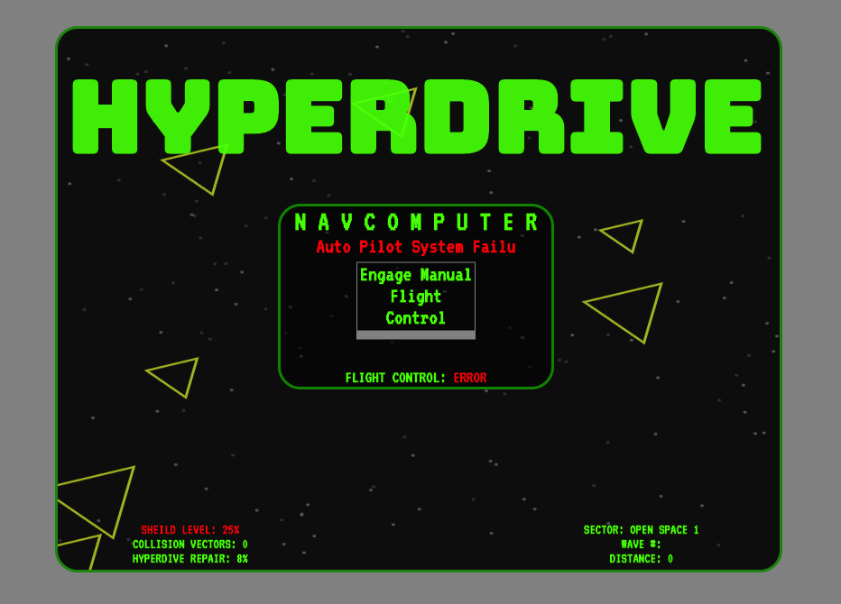
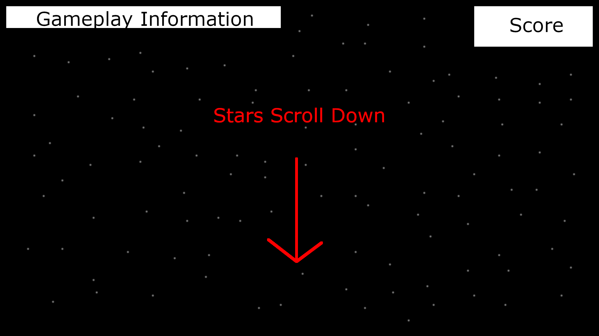
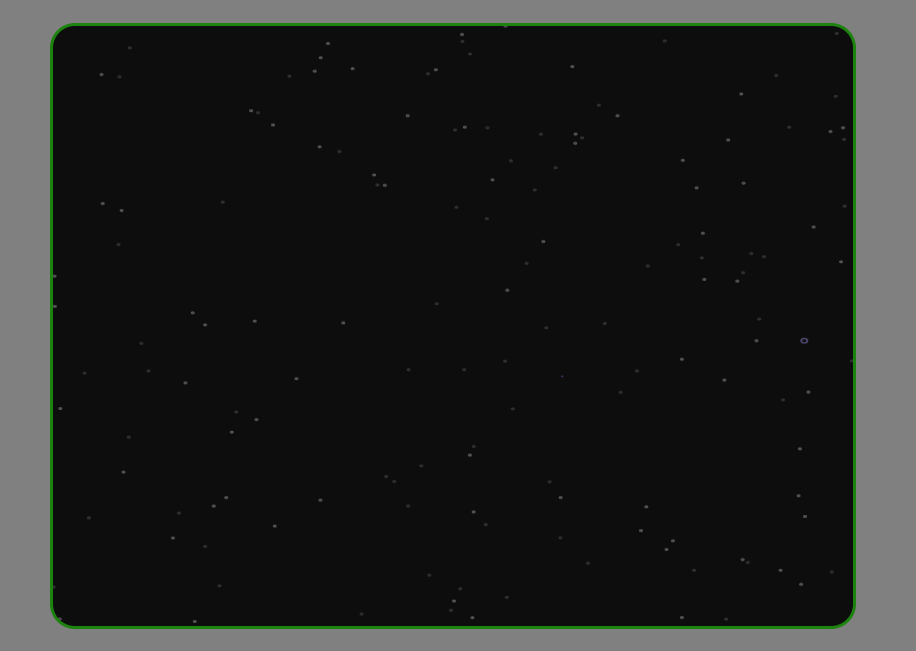
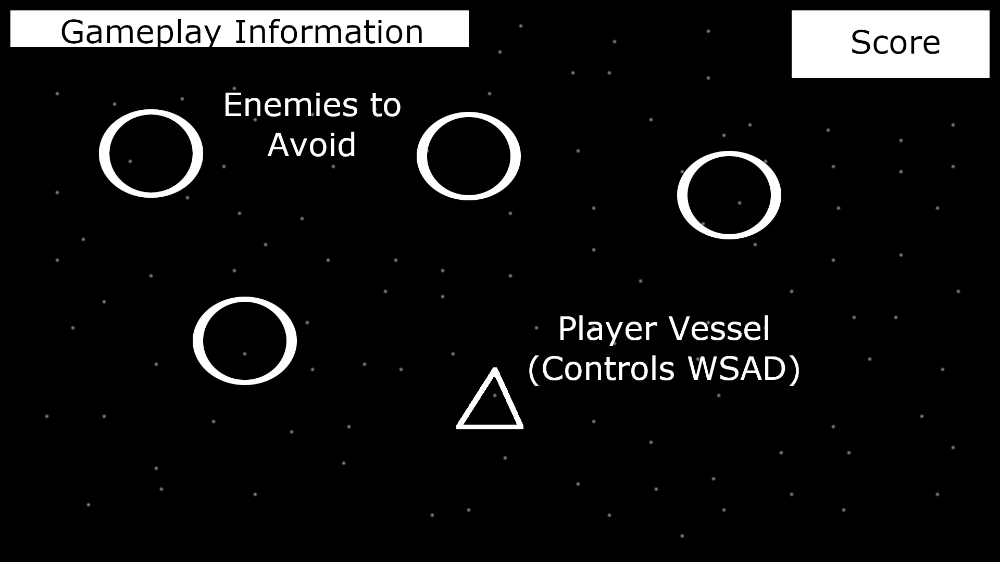
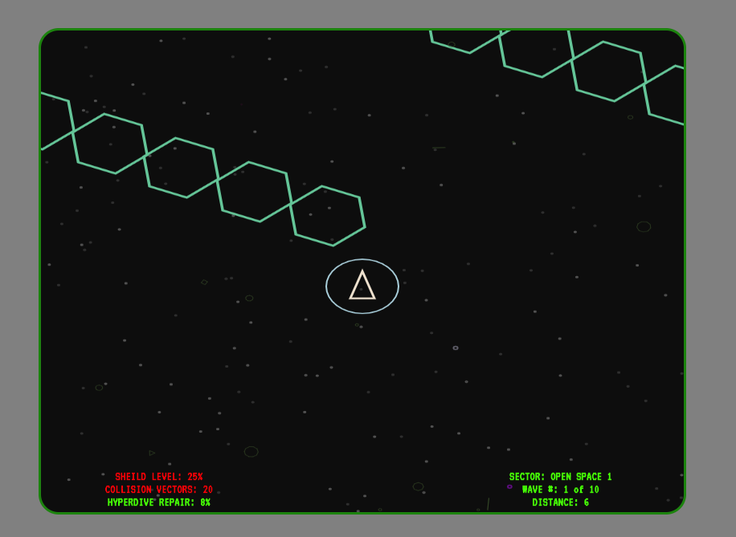

# Hyperdrive - Project 1

## Overview

Hyperdrive is a retro-futuristic styled space-themed vertical scrolling infinite runner game where the player controls a ship (isosceles triangle) with the WSAD keys and must avoid collisions with polygon enemies of various shapes and sizes that appear at the top of the screen and move in various ways. They play can activate the ship's shield to avoid collisions, but the shield loses power each time and only recharges every 50 distance points. The shield starts at a lower power and charges up as the game advances.

The polygon enemies appear in randomly chosen waves, with semi-randomized attributes, and after a semi-random amount waves the level increases. Higher levels currently spawn more difficult enemy waves by influencing values such as total enemies spawned at once and the speed at which they move. When the game is over, the distance the player traveled, the waves survived and the total amount of enemies successfully avoided is displayed on a scoreboard. 

Future plans include implementing a win condition when the player achieves a hyperdrive repair level of 100%, but as it stands the game only has a lose condition and a score for survival time.  

## MVP

[x] A functional menu for starting and Ending 

[x] a game play HUD with score and possible other info area like 'wave 3 incoming'

[x] a scrolling space background

[x] a player controlled ship

[x] waves of obstacles

[x] hit detection that ends the game if the player collides with and obstacle

## Stretch Goals

[x] a shield the player can activate

[x] a variety of enemies that vary in shape, size, color and movement (such as enemies that bounce off each other or enemies that accelerate as they move forward)

[x] music and sound

[x] a more complex level system (such as certain enemies only coming after wave 5 for example or backgrounds and music that change after a certain wave)

[] enemies that fire projectiles that need to be avoided

[] bonus power ups like invincibility for a short period

## Technical Overview

> Hyperdrive uses HTML5 and vanilla JavaScript

#### All game elements rendered on screen are classes with three main elements: 

* constructors that contain all relevant information for that object (such as current x, y screen positions)
* an update method that is called every frame to read object information and update it (such as reading current x, y screen position values and updating them to new ones to move the object)
* a draw method to be called after the update method to render the object with new values

#### Collision detection is based on circles, with the following procedure: 

  * sum the radii of the circles (r1 + r2)
  * find the distance between the circles by calculating the difference between the x values and squaring them, calculating the difference the y values and squaring them, summing the two squares and then finding the square root of the sum  
  * if the distance is less than the sum of the radii, a hit is detected
  * (r1 + r2) > √((x1 + x2)^2 + (y1 + y2)^2) 

#### Polygons are created by calculating using sin and cos in a unit circle and stroking them on canvas

  * by treating the radius of a circle as the hypotenuse of a triangle, x y positions of any point on the circle can be found because sin(angle) = opposite/hypotenuse (y) and cos(angle) = adjacent/hypotenuse (x)
  *  x position to draw on circle = center x of circle - radius * (cosine of (two pi / number of sides) * angle number + starting degrees as radians)
  * y position to draw on circle = center y of circle - radius * (sine of (two pi / number of sides) * angle number + starting degrees as radians)

#### Other technical elements:

* keypresses are pushed to an array the time of the event and a function handles keyboard input during the render loop
* The Menus and HUD are styled HTML elements 
* All DOM manipulation is handled with functions
* a setInterval() calculates distance traveled
* arrays store the star background objects
* arrays store polygon enemies to be referenced for hit detection
* arrays store objects for particle effects (exhaust and debris)

#### Waves of enemies are handled by a WaveMachine class

* Enemy waves are handled by functions that contain for loops that and push new enemy objects to the enemy array
* The waves functions are passed to the wave machine as in an array as function pointers so it can randomly choose an index to call a function

## example pseudo code prototype for Star class

> a bunch of stars will be pushed to an array on game start to make the background, the render loop will iterate through the star array to update and draw each of them. The enemy obstacle array will work similarly but also check for hit detection.

```

class Star {
  //variations in star properties to create a dynamic background
  constructor(speed, x, y, color, size){
    this.speed = speed;
    this.x = x;
    this.y = y;
    this.color = color;
    this.size = size;
  }
  //called by render loop to move star
  update(){
    //increment y value with speed to move star down
    this.y += this.speed;
    //if star moves off screen, reset y and randomize x to repurpose it as a new star
    if(this.y > canvasHeight){
      this.y = 0;
      this.x = Math.randoom * canvasWidth;
    }
  }
  //called by render loop to draw
  draw(){
    //color is determined when the object is created so stars that are farther away can be more opaque
    //stars to be drawn are just little circles
  }
}

```

## Wire Frames

I immediately realized how dumb it was to plan to have the gameplay information and score at the top of the screen when I started laying out the HTML elements on the page, and switched them to the bottom of the screen. Below are wireframes and final game screen grabs for comparison

### Game start and Menu Wire Frame



### Game start and Menu in Hyperdrive



### Background Wire Frame



### Hyperdrive Background



### Wire frame of Gameplay 



### Hyperdrive Gameplay



## Closing thoughts

After seeing how canvas crawler worked, I really wanted to challenge myself to work in an object oriented way with this project, and this is the first project that I really tried to do so. In some ways I succeeded and others I failed. My main goal was to create an OO MVP that was scalable into something bigger, and I feel like I succeed here. In the past, I have had several projects fall apart because their scope grew beyond want my skills could handle, and I am sure that this wouldn't have happened if I had used an OOP model in these projects but I wasn't able to full grasp how to plan something like that out.

The objects being rendered on screen all being handled as classes is a big success in terms of planning and execution. After working so much with classes I had an epiphany on how to refactor the DOM manipulation in an elegant OOP way after having creating a class to handle audio towards the end of this project. Handling the DOM elements with functions is okay, but somewhat verbose, and I feel like I could do better. Two epiphany moments for me during this project where I learned how to leverage class methods like functions by using anonymous functions as wrappers:

```
setTimeout( () => { Class.method(); }, 10)
```

also when I learned the best way to interact with functions being passed around as as arguments or in arrays as arguments is by assigning them a variable first.

```
function pointer1(){
  //do stuff
}

function pointer2(){
  //do other stuff
}

function passMeFunctions(array){
  let firstOneToCall = array[0];
  let secondOneToCall = array[1];
  firstOnToCall();
  secondOneToCall();
}

let twoFunctions = [pointer1, pointer2];

passMeFunctions(twoFunctions);
```

I really feel like I failed hard with HTML element names and organization of the GUI. I started out with a good system but due to poor planning the id names turned into a complicated disaster and as I added more things I did not plan for, it turned into a nightmare to sort it out. Refactoring this part of the code is high on the priority list. 

Working on this project was an absolute blast, and I will certainly keep working on it. After a code solid refactor and a knocking out a list of tidying-up stuff i plan on adding additional elements to make it a more full-fledged game. 

## Source:

#### tutorials

collision detection with circles

https://developer.mozilla.org/en-US/docs/Games/Techniques/2D_collision_detection

playable canvas asteroids (inspired code structure and particle effects)

https://codepen.io/jeffibacache/pen/bzBsp

js canvas asteroids tutorial (this dives into polygon maths in a great way about 10 min in)

http://www.newthinktank.com/2019/07/javascript-asteroids/

breakout on canvas

https://developer.mozilla.org/en-US/docs/Games/Tutorials/2D_Breakout_game_pure_JavaScript

#### other 

typewriter effect with setTimeout()

https://www.w3schools.com/howto/howto_js_typewriter.asp

cool code pen with circle hit detection

https://codepen.io/DonKarlssonSan/pen/MWwGvGM

about classes and extends keyword

https://javascript.info/class-inheritance


#### math

trig maths with neat illustrations

https://www.mathsisfun.com/algebra/trigonometry.html

more math

https://www.purplemath.com/modules/unitcirc.htm

#### tutorials I looked at when considering frameworks vs vanilla js

p5

http://www.baruchadi.com/dev/game/p5js/2019/04/16/how-to-make-a-browser-game-with-p5js.html

phaser

https://leanpub.com/html5shootemupinanafternoon/read