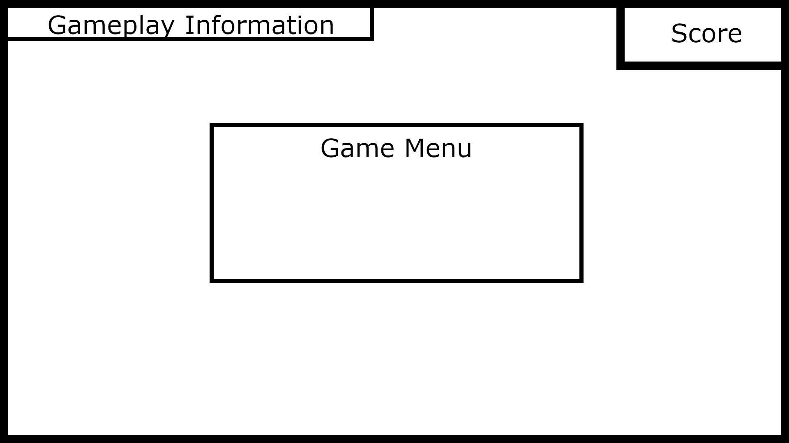
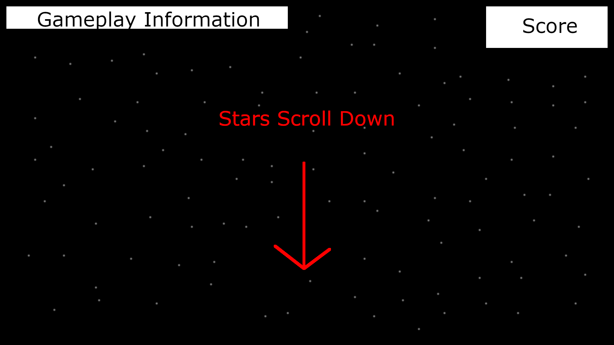
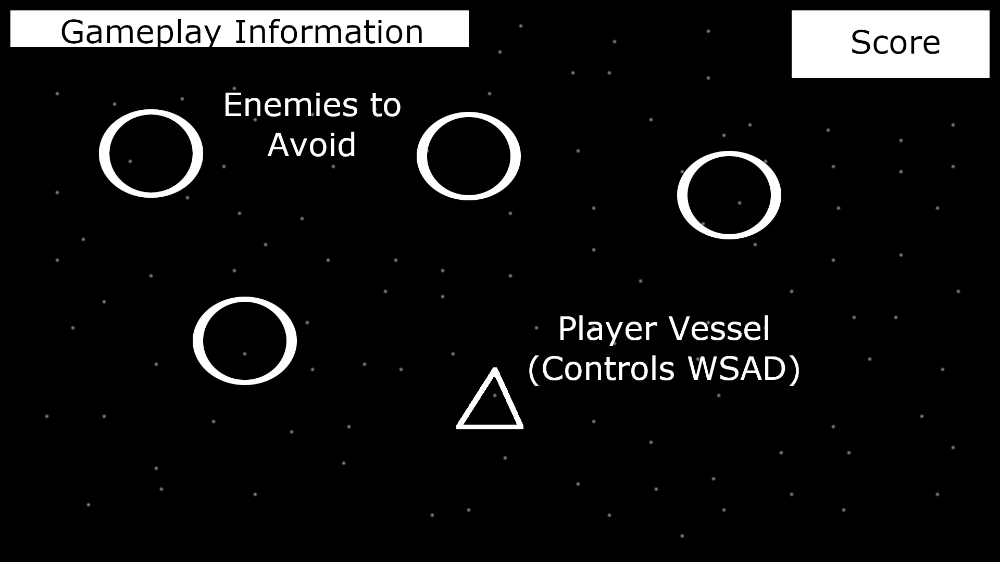

# Project 1

## Idea Overview

For this project I would like to build a space themed endless runner game where the player controls a spaceship and must navigate through a series of enemies and obstacles to survive. Score would be calculated by the time the player survived. I was originally thinking that I would make a vertically scrolling shoot 'em up type game, but I decided that I'd prefer to create something less violent. I'd like the gameplay to be similar to a scrolling shoot 'em up, but have the emphasis be on manuevering rather than shooting. Obstacles and enemies will appear in waves and the end of waves will be punctuated with a moment of repose for the player to prepare for the next increasinly difficult wave. 

Stretch goals could include additional gameplay elements like a sheild or cloaking ability the player could activate to avoid collisions. I really enjoy games that have a procedurally generated element or randomness to them, and I'd like to incorporate this by having enemy wave types be somewhat random, but still increasingly difficult as the game progesses. 

> I plan on using HTML5 canvas and Plain JavaScript to create this game

## Technical Overview

I plan on implementing a scrolling background of stars, with two or more layers of stars moving at different speeds to create a paralax sense of depth and movement. Distance traveled for scoring will be kept track of with a timer and displayed on screen. Enemies and obstacles will appear at the top of the canvas and will move towards the player. The player will use WSAD controls to move thier spacecraft, the left and right of the canvas will wrap the player's craft around to the other side, and the plyer will not be abe to move beyond the top or bottom boundries of the canvas.

Instead of using sprites, I would like to use abstract geometric shapes to represent gameplay elements as a nod to older 'golden era arcade games'. The player's ship will be an isosceles triangle and enemies and obstacles can be a range of polygons and other geometric shapes such as circles or spinning squares. After researching collsion detection, I would like to use circle collision detection, as it seems lightweight and circle collision radii can be assigned to any object. Objects can appear to spin with circle collision detection without the hit area being affected. 

#### All game elements rendered on screen will be classes with three main elements: 

* constructors that contain all relevent information for that object (such as current x,y screen positions)
* an update method that is called every frame to read object information and update it (such as reading current x, y screen position values and updating them to new ones to move the object)
* a draw method to be called after the update fuction to render the object with new values

#### Collision detection will be based on circles, with the following procudure: 

  * sum the radii of the circles (r1 + r2)
  * find the distance between the circles by calculating the difference between the x values and squaring them, calculating the difference the y values and squaring them, summing the two squares and then finding the square root of the sum √((x1 + x1)^2 + (y1 + y2)^2) 
  * if the distance is less than the sum of the radii, a hit is detected

#### Other technical elements:

* A function will handle keyboard input
* a timer to calculate distance traveled and the difficulty
* an obstacle generator that will make waves of obstacles somewhat randomly but based on distance for difficulty (I need to plan this part out more, explore possibly making a wave generator class to handle the logic)
* arrays to store the star background objects
* arrays to store obstacles and enemies to be referenced for hit detection
*on screen menu handling for game start/end

#### Ideas for generating waves of enemies:

I'm still conceptualizing this part, but I think maybe a wave generator could choose from a few obstacles to create, make a bunch of them and push them to an array. They would be generated with semi random negetive y values that would increment until the obstacles appeared on screen. As a part of the enemy obstacles classes' update methods, a could check be made to see if they are in the bounds of the screen and if so, a true/false 'onscreen' value could be updated to trigger rendering and collision detection. A garbage collector fuction could be ran to check to see if obstacles had moved back off screen with a y value that was greater than the screen heigth, and if so, the obstacle would be spliced from the array of enemy obstacles. If the wave generator was a class, the wave generator object could be replaced with an updated object with harder level values when certain distance score were obtained by the player. 

## example pseudo code prototype for Star class

> a bunch of stars will be pushed to an array on game start to make the background, the render loop will iterate through the star array to update and draw each of them. The enemy obstacle array will work similarly but also check for hit detection

```

class Star {
  //variations in star properties to create a dynamic background
  constructor(speed, x, y, color, size){
    this.speed = speed;
    this.x = x;
    this.y = y;
    this.color = color;
    this.size = size;
  }
  //called by render loop to move star
  update(){
    //increment y value with speed to move star down
    this.y += this.speed;
    //if star moves off screen, reset y and randomize x to repurpose it as a new star
    if(this.y > canvasHeight){
      this.y = 0;
      this.x = Math.randoom * canvasWidth;
    }
  }
  //called by render loop to draw
  draw(){
    //color is determined when the object is created so stars that are farther away can be more opaque
    //stars to be drawn are just little circles
  }
}

```

## Wire Frames

### Game start and Menu



### Game start and Menu



### Game start and Menu



## MVP

[] A fuctional menu for starting and Ending 

[] a gameplay HUD with score amd possible other inof like 'wave 3 incoming'

[] a scrolling space background

[] a player controlled ship

[] waves of obstacles

[] hit detection that ends the game if the player collides with and obstacle

## Stretch Goals

[] a sheild the player can activate

[] a variety of enemies that vary in shape, size, color and movement (such as enemies that bounce off each other or enemies that accelerate as they move forward)

[] music and sound

[] a more complex level system (such as certain enemies only coming after wave 5 for example or backgrounds and music that change after a certain wave)

[] enemies that fire projectiles that need to be avoided

[] bonus power ups like invincibility for a short period
